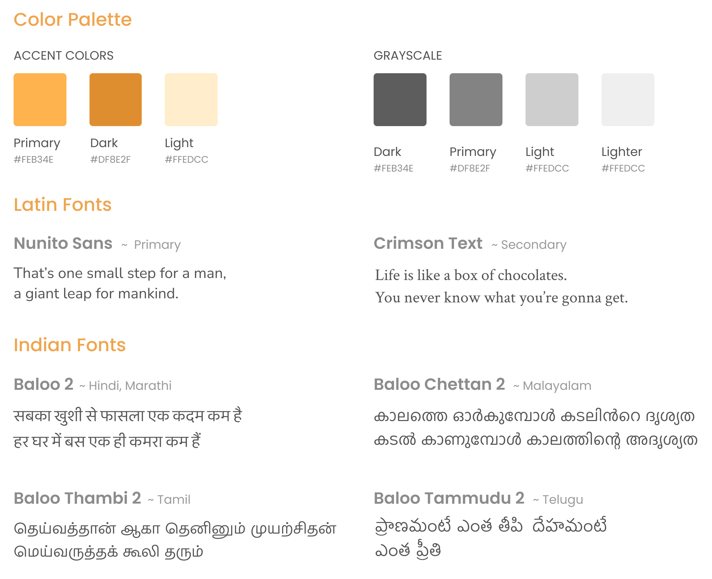

# Section A
## Section Title

Apparently we had reached a [great height](https://google.com) in the atmosphere, for the sky was a dead black, and the stars had ceased to twinkle. By the same illusion which lifts the horizon of *the sea to the level* of the spectator on a hillside, the sable cloud beneath was dished out, and the car seemed to __float in the middle of an__ immense dark sphere.

1.  Apparently we had reached a great height
2.  By the same illusion which lifts the horizon
3.  Looking down into the dark gulf below
4.  I could see a ruddy light streaming through

# Section B

## Section Title (again)

Looking down into the dark gulf below, I could see a ruddy light streaming through a rift in the clouds. Looking down into the dark gulf below, I could see a ruddy light streaming through a rift in the clouds. Looking down into the dark gulf below, I could see a ruddy light streaming through a rift in the clouds.

### Section Sub title

Apparently we had reached a great height in the atmosphere, for the sky was a dead black, and the stars had ceased to twinkle. By the same illusion which lifts the horizon of the sea to the level of the spectator on a hillside.

Apparently we had reached a great height in the atmosphere, for the sky was a dead black, and the stars had ceased to twinkle. 

#### Blockquote

- Apparently we had reached a great height
- By the same illusion which lifts the horizon
- Looking down into the dark gulf below

## something else

- I could see a ruddy light streaming through
- Sable cloud beneath was dished out

