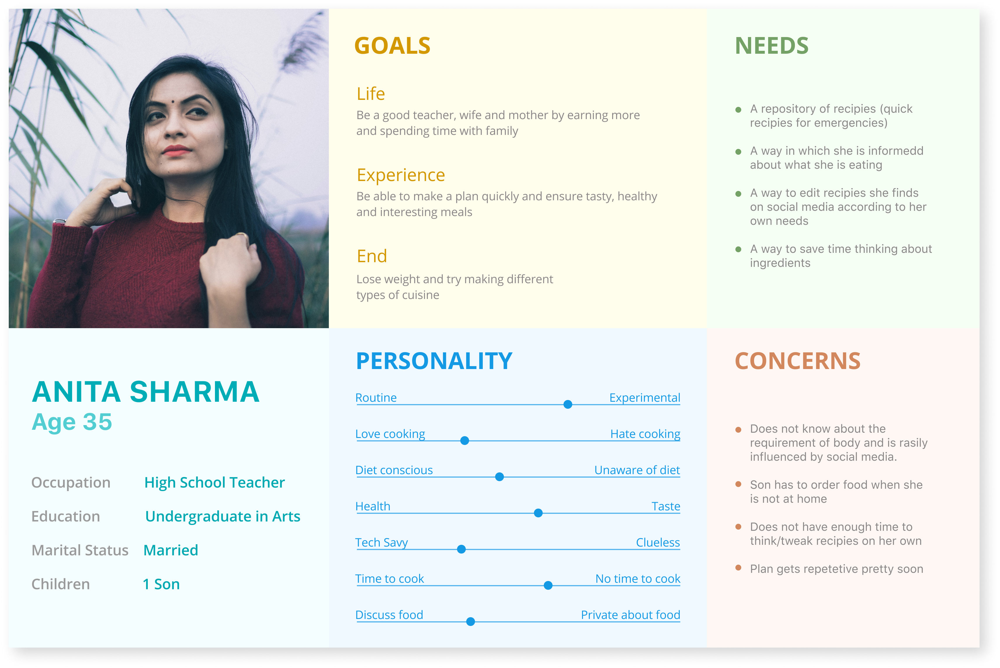
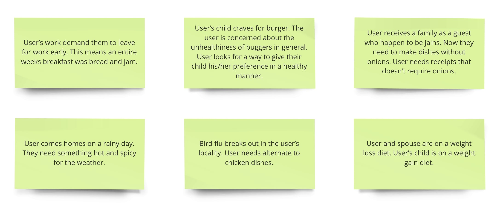
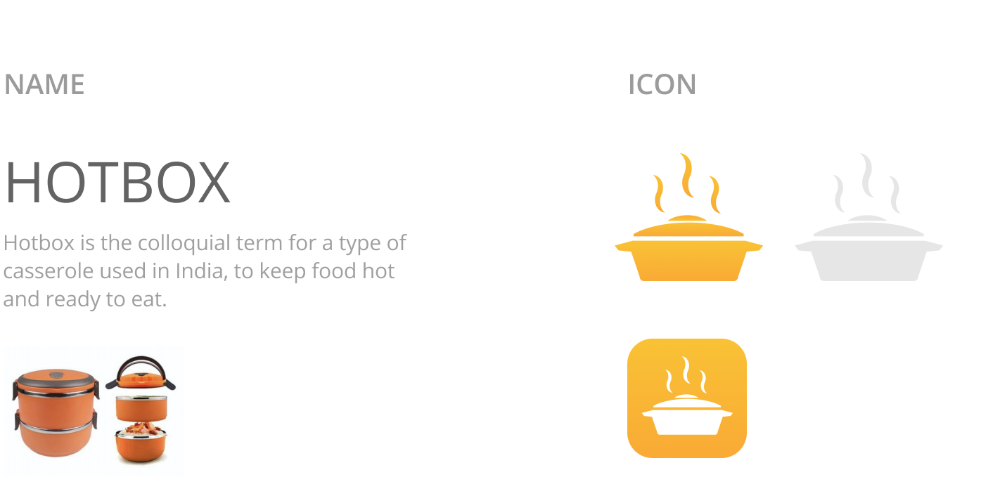
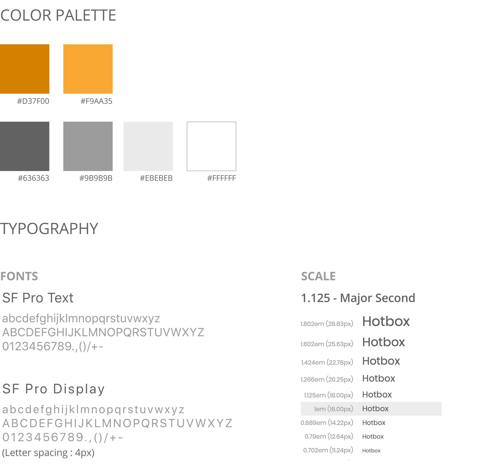

# Product

## A need for better diet habits

Sensitivity towards food, nutritional requirements of a person is greatly decreasing day by day. Data released by WHO suggests that over the past 33 years, worldwide overweight and obesity rates among adults have increased by 27.5%, while such rates among children have increased by 47.1%.
We aimed to explore the possibilities to contribute to the betterment of sensitivity towards food, nutrition and diets in households in India using contextual research and design intervention.

# Research

## Understanding the Problem

### Contextual Interviews
To understand the dietary behaviour of households, we started our research with contextual interviews. Our initial target users were anyone who cooks or manages cooking at home. After a few interviews, we redefined our target users as households with multiple members and working adults. To prevent biases and avoiding missing out on details, we created a guideline to conduct interviews.

- Interviewing users when and where they cook
- Observing the user while they plan and cook
- Taking the role of an apprentice with the user, as a master

### Affinity Mapping

Interview notes offered us a good insight into each user’s dietary behaviour. But individuals tend to have biases and specific focus points and it is necessary to consolidate every perspective to see if there are patterns that emerge.

Each of the interview points was classified and color coded.

- User Statements
- Insights
- Contextual Inquiry
- Breakdown
- Design Intervention
- Follow-up Questions

The notes were then clubbed together based on similarity and causation. This helped in reducing about 450 notes into a few categories that offered the essence of the collective insight.

Any pattern identified is an area to work on. At this stage, we got to see a broader perspective by connecting the dots from each observation and creating inferences. These inferences led to the development of meaningful insights that were invisible earlier.

From the affinity maps, we were able to establish causation, intent and other dynamics involved in the act of cooking. We then extracted the top insights from affinity mapping, which helped us create a redefined design brief for our app.

### Revised Design Brief

Helping people with time constraints, plan and follow personalised healthy, tasty and varied meals for the entire family. Problems to be solved:

- Reduce the cognitive load of planning a diet
- Time and resource optimisation
- Ensure a healthy and interesting diet
- Manage the kitchen inventory
- Track consumption and nutrition intake

### Personas

When we bundled up all the problems faced by our user groups, they were quite varied and were from different sources. We created narratives for multiple personas, detailing out different aspects of their lifestyle and dietary habits.

The personas created were then classified into

- Primary persona
- Secondary persona
- Supplementary persona
- Negative persona

The primary persona was chosen and detailed out to help us focus on the exact requirements.

### Scenarios

The next step was to imagine the scenarios of our primary persona and understand what exactly would our solution offer. This step helped us in coming up with features for the app.

# Design

## Implementing the solutions

### Information Architecture

### Identity

### Style Guide

### Atomic Elements

### Compound Elements

### UI Design

