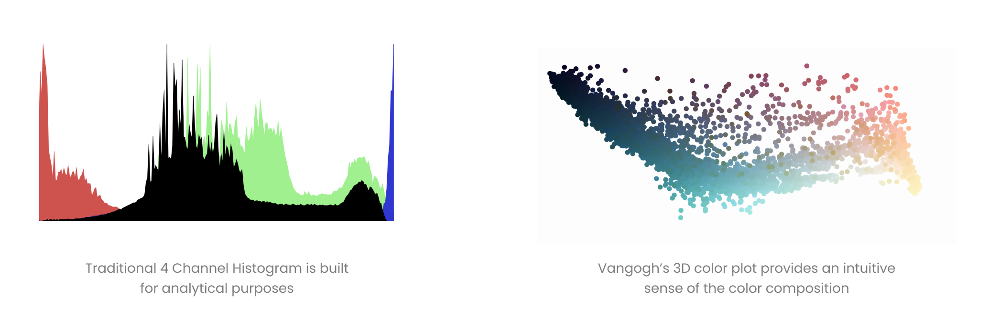
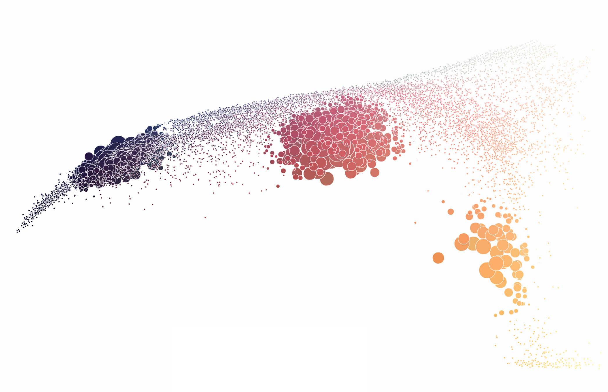
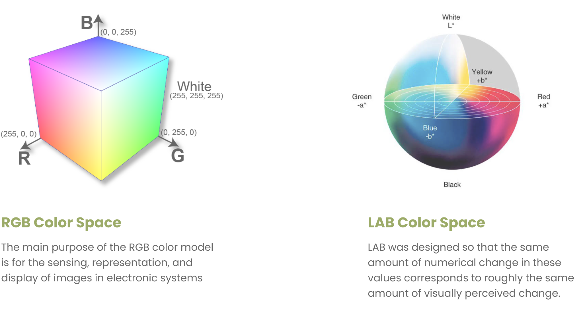

# Product

## Google, but for color palettes

Color Palettes. We all have spent countless hours struggling to find the right palettes. There are a few tools out there to help with this but all lack context. In every design process, we look for palettes for a given theme or an idea and one usually starts with their personal interpretation of the term. Its a long process, but can we create something that can aid us here?

> What if we can search for color palettes the same way we search for images in Google?

Vangogh is a web based tool that let's you search for color palettes with any search term like **sunset**, **deep ocen**, **cherry blossoms**. Alternatively you can upload an image and extract color palettes from it.

# Concept

## Extracting our collective color sense

Color palettes for a particular theme, reflect our interptations of those themes. Overtime, we've repeated this process so many times when creating photographs, art and designs. Internet is full of such images, where the creator has deliberately chosen palettes to evoke the feel of a certain idea.

### The Protoype

I made a quick protoype to test the validity of the concept. It downloads images from Google search results for the search term entered and picks 4 dominant colors from each image to create the palette. I fired up a basic version for test the idea in the wild.

It seemed to work, indicating that this direction has potential. While it was just a protoype, it shed light on lot of implementaional details that had to be set right for a functional tool. Few key takeaways -

- Search results had lot of unrelated images
- Image background interference
- Google results were repetative
- Lot of 'noise' in the palettes
- Mobile version has no usecase (?)

With these pointers, I set out to build Vangogh v2.0

### The Product

Learning from the previous iteration, I introduced multiple ways to smartly filter and extract color palettes. 

This concept produced good enough results that could make it into a functional design tool. With the core functinalities ready, I started designing the interface.

# Design

## Designing a design tool

Vangogh being a design tool, I prioritize functionlity over everything else. I chose a single page design for the search result page, to keep the content concise and not overwhelm the users. 

>  Simplicity. Utility. Delight.

### Search page

Multiple utility functions like copying the color code, downloading the swatch, regenerating the palettes were added while keeping the UI clutter at minimum. 

### Color composition visualisation

Although multiple palettes with various styles were provided, it was helpful to show the color space from where the palette was created from, to help users understand the context of the palette better. Histograms are the most common ways to visulise color distribution but it wasn't intuitive enough for an average user to understand. I created a 3D interactive visualisation to plot the colors. It also added an element of delight to the experience. 

### Filling the gaps

With the main search page done, other supplimentary pages were designed. The langing page was kept simple with just a search bar in description of the app. Based on feature requests from the prototype, an option to generate palettes from an image was added. Since Vangogh already does this for the search page, it was just about adding another interface for this functionality. Last, I added an about page that explains the working of the tool.

# Engineering

## The Tech behind it all

### The Algorithm

Vangogh used a modified version of [K-Means Clustering](https://stanford.edu/~cpiech/cs221/handouts/kmeans.html) for both grouping the images based on perceptual similarity and extracting palettes from images. K-Means Clustering is a Machine Learning algorithm that can identify clusters in a given data. In this case, the color compositions are the data points and the cluster centers are dominant colors of the image.

### The Color Space

RGB is very convenient when it comes to displays. But it doesn’t reflect the way humans perceive colors. Importantly, the difference between numerical representations doesn’t reflect the perceived difference. This becomes a problem while doing K-Means Clustering. To solve this, I chose [LAB](https://azure.microsoft.com/en-in/services/cognitive-services/) (created by Adobe) as its much closer to how human perceive colors.

### The Visualisation

To create the 3D interactive visualisation, I used [Plotly JS](https://plotly.com/javascript/)'s 3D scatter plots. The scales and grids were removed for an immersive effect. The color space stayed as RGB instead of LAB as the GRB cube was much more intuitive to visualise. 

### The Tech Stack

Since it was an experimental project, I chose a lightweight tech stack so ddevelopment can be rapid.

- python - backend
- [flask](https://flask.palletsprojects.com/en/1.1.x/) - server
- [scikit-learn](https://scikit-learn.org/stable/) - ML Library
- [jQuery](https://jquery.com) - front-end
- [plotly.js](https://plotly.com/javascript/) - visualisation
- AWS EC2 - server host
- [Bing Cognitive Services](https://azure.microsoft.com/en-in/services/cognitive-services/) - search

Managing a server on AWS was not fun because my lack of experience. Temporarily, its hosted on Heroku and I'm planning to make it serverless sometime in the future.

# Shipping

## Micro SaaS ?

Stats

