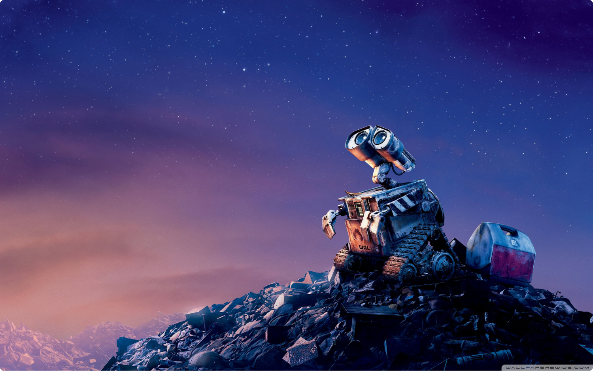

# RESEARCH
## Great height in the Atmosphere

Apparently we had reached a [great height](https://google.com) in the atmosphere, for the sky was a dead black, and the stars had ceased to twinkle. By the same illusion which lifts the horizon of the sea to the level of the spectator on a hillside, the sable cloud beneath was dished out, and the car seemed to float in the middle of an immense dark sphere.

Apparently we had reached a great height in the atmosphere, for the sky was a dead black, and the stars had ceased to twinkle. By the same illusion which lifts the horizon of the sea to the level of the spectator on a hillside, the sable cloud beneath was dished out.

Apparently we had reached a great height in the atmosphere, for the sky was a dead black, and the stars had ceased to twinkle. By the same illusion which lifts the horizon of the sea to the level of the **spectator on a hillside, the sable cloud beneath was dished out**, and the car seemed to float in the middle of an immense dark sphere, whose upper half was strewn with silver.

# PRODUCT
## Great height in the World

Looking down into the dark gulf below, I could see a ruddy light streaming through a rift in the clouds. Looking down into the dark gulf below, I could see a ruddy light streaming through a rift in the clouds. Looking down into the dark gulf below, I could see a ruddy light streaming through a rift in the clouds.

### Designing the Interface

Apparently we had reached a great height in the atmosphere, for the sky was a dead black, and the stars had ceased to twinkle. By the same illusion which lifts the horizon of the sea to the level of the spectator on a hillside, the sable cloud beneath was dished out, and the car seemed to float in the middle of an immense dark sphere, whose upper half was strewn with silver. Looking down into the dark gulf below, I could see a ruddy light streaming through a rift in the clouds.

Apparently we had reached a great height in the atmosphere, for the sky was a dead black, and the stars had ceased to twinkle. 

## Great height in the Sky

By the same illusion which lifts the horizon of the sea to the level of the spectator on a hillside, the sable cloud beneath was dished out, and the car seemed to float in the middle of an immense dark sphere, whose upper half was strewn with silver. Looking down into the dark gulf below, I could see a ruddy light streaming through a rift in the clouds.

#### Apparently we had reached a great height in the atmosphere, for the sky was a dead black, and the stars had ceased to twinkle. By the same illusion which lifts the horizon of the sea.

Apparently we had reached a great height in the atmosphere, for the sky was a dead black, and the stars had ceased to twinkle. By the same illusion which lifts the horizon of the sea to the level of the spectator on a hillside, the sable cloud beneath was dished out, and the car seemed to float in the middle of an immense dark sphere, whose upper half was strewn with silver. Looking down into the dark gulf below, I could see a ruddy light streaming through a rift in the clouds.

##### This project is under NDA so certain sensitive parts are redacted.

Apparently we had reached a great height in the atmosphere, for the sky was a dead black, and the stars had ceased to twinkle. By the same illusion which lifts the horizon of the sea to the level of the spectator on a hillside. 

# ENGINEERING
## Great height in the Plant

The sable cloud beneath was dished out, and the car seemed to float in the middle of an immense dark sphere, whose upper half was strewn with silver. Looking down into the dark gulf below, I could see a ruddy light streaming through a rift in the clouds.

1.  Apparently we had reached a great height
2.  By the same illusion which lifts the horizon
3.  Looking down into the dark gulf below
4.  I could see a ruddy light streaming through

# DESIGN
## Great height in the atmosphere

Apparently we _had reached a great height in the atmosphere_, for the sky was a dead black, and the stars had ceased to twinkle. By the same illusion which lifts the horizon of the sea to the level of the spectator on a hillside, the sable cloud beneath was dished out, and the car seemed to float in the **middle of an immense dark** sphere, whose upper half was strewn with silver. Looking down into the dark gulf below, I could see a ruddy light streaming through a rift in the clouds.

- Apparently we had reached a great height
- By the same illusion which lifts the horizon
- Looking down into the dark gulf below
- I could see a ruddy light streaming through
- Sable cloud beneath was dished out

Apparently we had reached a great height in the atmosphere, for the sky was a dead black, and the stars had ceased to twinkle.

## Building the tech stack

Apparently we had reached a great height in the atmosphere, for the sky was a dead black, and the stars had ceased to twinkle. By the same illusion which lifts the horizon of the sea to the level of the spectator on a hillside, the sable cloud beneath was dished out, and the car seemed to float in the middle of an immense dark sphere, whose upper half was strewn with silver. Looking down into the dark gulf below, I could see a ruddy light streaming through a rift in the clouds.

Apparently we had reached a great height in the atmosphere, for the sky was a dead black, and the stars had ceased to twinkle. By the same illusion which lifts the horizon of the sea to the level of the spectator on a hillside, the sable cloud beneath was dished out, and the car seemed to float in the middle of an immense dark sphere, whose upper half was strewn with silver. Looking down into the dark gulf below, I could see a ruddy light streaming through a rift in the clouds.

#### Apparently we had reached a great height in the atmosphere, for the sky was a dead black, and the stars had ceased to twinkle. By the same illusion which lifts the horizon of the sea.

Apparently we had reached a great height in the atmosphere, for the sky was a dead black, and the stars had ceased to twinkle. By the same illusion which lifts the horizon of the sea to the level of the spectator on a hillside, the sable cloud beneath was dished out, and the car seemed to float in the middle of an immense dark sphere, whose upper half was strewn with silver. Looking down into the dark gulf below, I could see a ruddy light streaming through a rift in the clouds.