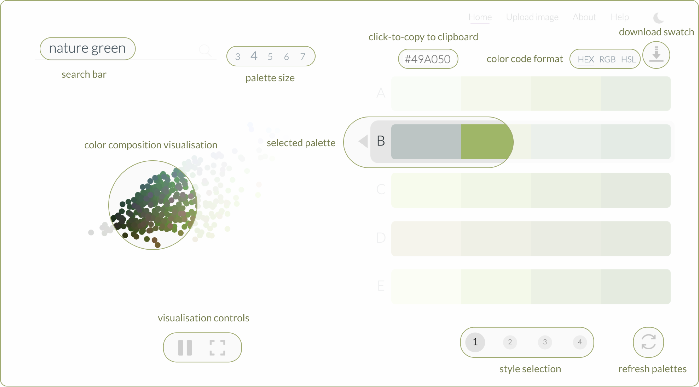

# Product
## An antidote for the information pandemic

With the onset of the global pandemic - COVID19, another type of pandemic plagued the world - information. Being a new subject, people were hooked onto learning more about it. It proved to be very tricky, especially in the Indian context, with the advent of fake news, WhatsApp forwards and language barriers among other reasons.

I initiated a volunteer-driven effort, to tackle this and CovidWire was born. We curated local and international news on COVID 19, summarised and translated them and made it accessible through a mobile web app.

> Curate. Summarise. Translate. Share.

### Consumer facing Webapp

We designed and built a PWA (Progressive Web APP) in an agile development model and distributed news pieces processed by our volunteers to our 2000+ daily users.

### Volunteer content platform
Along with the user-facing web app, we also designed and implemented the content creation and management platform for our 110+ volunteers. We utilised **no-code** and **low-code** solutions to create a responsive environment to coordinate our content efforts.

With the onset of the global pandemic - COVID19, another type of pandemic plagued the world - information. Being a new subject, people were hooked onto learning more about it. It proved to be very tricky, especially in the Indian context, with the advent of fake news, WhatsApp forwards and language barriers among other reasons.

I initiated a volunteer-driven effort, to tackle this and CovidWire was born. We curated local and international news on COVID 19, summarised and translated them and made it accessible through a mobile web app.
